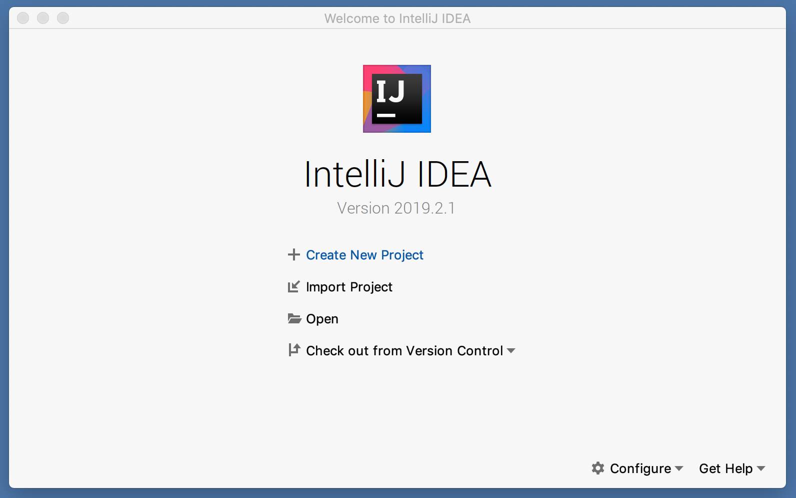
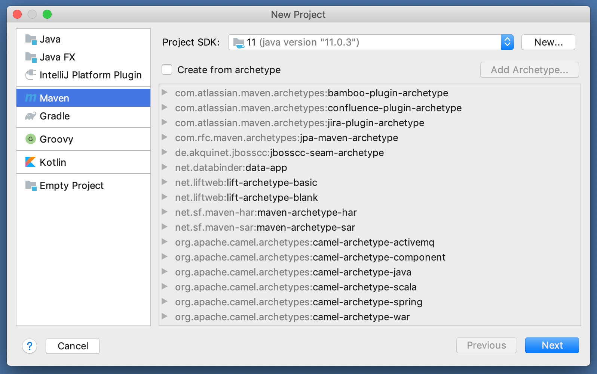
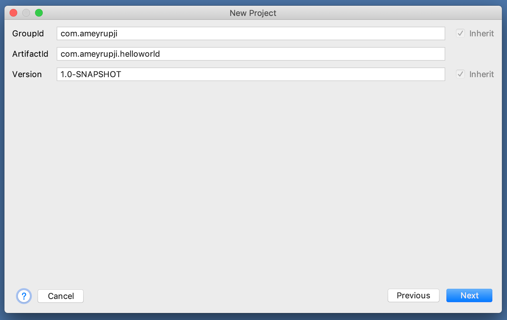
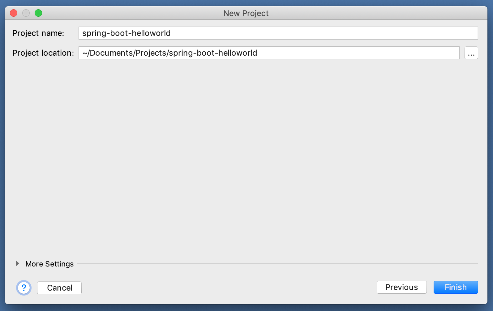
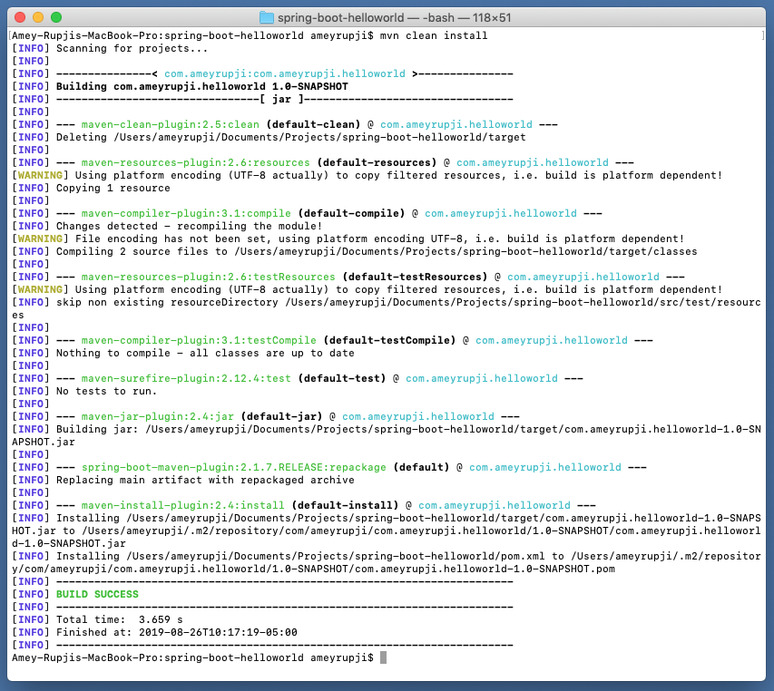
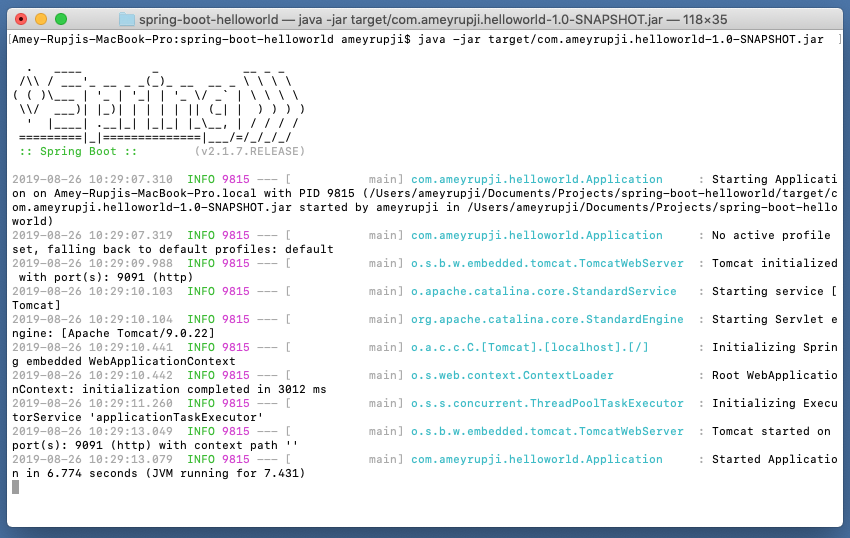
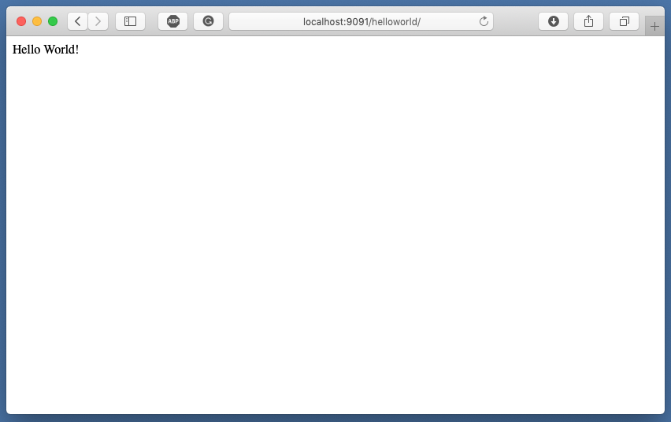

| ◂ Previous |
|-----|

# spring-boot-helloworld
Basic Hello World Application in Spring Boot! This example creates a Java executable for running a Spring Boot application with a Controller that returns "Hello World".


## Prerequisites

- Java IDE (I am using IntelliJ CE)
- Maven

## System Configuration at time of test

- macOS High Sierra - Version 10.14.6
- IntelliJ CE - Version CE 2019.2
- Maven - Version 3.6.1

## Initial Setup

### Create a Maven project

Create a new Maven Java application following the steps below










### Add Spring Boot dependencies

In the `pom.xml` file add the `spring-boot-starter-web` dependency as shown below:

```xml
    <dependencies>
        <dependency>
            <groupId>org.springframework.boot</groupId>
            <artifactId>spring-boot-starter-web</artifactId>
            <version>2.1.7.RELEASE</version>
        </dependency>
    </dependencies>
```


### Making application executable

Create a new package `com.ameyrupji.helloworld`

Add a new Java class `Application.java` with the following code. This creates a standalone executable java application jar.

```java
package com.ameyrupji.helloworld;

import org.springframework.boot.SpringApplication;
import org.springframework.boot.autoconfigure.SpringBootApplication;
import org.springframework.context.annotation.ComponentScan;

@SpringBootApplication
@ComponentScan
public class Application {

    public static void main(String[] args) {
        SpringApplication.run(Application.class, args);
    }
}
```

`@SpringBootApplication` is a convenience annotation that adds all of the following:

- `@Configuration` tags the class as a source of bean definitions for the application context.
- `@EnableAutoConfiguration` tells Spring Boot to start adding beans based on classpath settings, other beans, and various property settings. For example, if spring-webmvc is on the classpath this flags the application as a web application and activates key behaviors such as setting up a DispatcherServlet.
- `@ComponentScan` tells Spring to look for other components, configurations, and services in the hello package, allowing it to find the controllers.
The main() method uses Spring Boot’s SpringApplication.run() method to launch an application. Did you notice that there wasn’t a single line of XML? No web.xml file either. This web application is 100% pure Java and you didn’t have to deal with configuring any plumbing or infrastructure.

Next add the `mainClass` definition to the `pom.xml` by adding the following configuration:

```xml
    <build>
        <plugins>
            <plugin>
                <groupId>org.springframework.boot</groupId>
                <artifactId>spring-boot-maven-plugin</artifactId>
                <version>2.1.7.RELEASE</version>
                <executions>
                    <execution>
                        <goals>
                            <goal>repackage</goal>
                        </goals>
                        <configuration>
                            <mainClass>com.ameyrupji.helloworld.Application</mainClass>
                        </configuration>
                    </execution>
                </executions>
            </plugin>
        </plugins>
    </build>

```

### Adding Hello World controller

Create a `controllers` package under `com.ameyrupji.helloworld` package.

Add a `HelloWorldController` Java class with the following code:

```java
package com.ameyrupji.helloworld.controllers;

import org.springframework.web.bind.annotation.GetMapping;
import org.springframework.web.bind.annotation.RequestMapping;
import org.springframework.web.bind.annotation.RestController;


@RestController
@RequestMapping(value= "/helloworld")
public class HelloWorldController {

    @GetMapping(value = "/")
    public String get() {
        return "Hello World!";
    }
}
```

### Changing the default Port for the application 

Create an `application.properties` with the following property:

```sh
server.port=9091
```

### Building the executable JAR 

Run the following maven command on the command line: `maven clean install`




### Running the application

Run the following command to run the application: `java -jar target/com.ameyrupji.helloworld-1.0-SNAPSHOT.jar`




## Test

Open Safari and go to the following url: `http://localhost:9091/helloworld/`




## Useful Links

- https://spring.io/guides/gs/rest-service/
- https://www.javaguides.net/2018/10/spring-mvc-5-hello-world-example.html

| [Next ▸](https://github.com/ameyrupji-k8s/docker-spring-boot-helloworld)</p> |
|-----|
